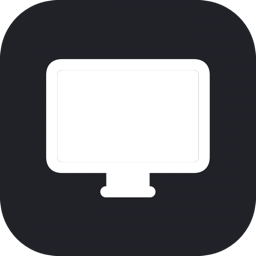

<div align="center">



# DisplayDisabler

**A tiny macOS menu-bar app for total control of your Mac's displays.**

Disable & enable screens · Force HiDPI · brightness with EDR boost · color warmth · window transparency, blur, keep-on-top & picture-in-picture · keep-awake — a free, lightweight alternative to the big commercial display utilities.

[](https://github.com/oabdrabo/DisplayDisabler/releases/latest)
[](LICENSE)
[](#requirements)
[](#requirements)

</div>

---

## ✨ Features

| | |
|---|---|
| 🖥️ **Disable / enable any display** | Turn off the built-in panel in clamshell/headless setups so it stays off when the lid opens. Optionally auto-disable the built-in whenever an external monitor connects — with a **failsafe** that re-enables the built-in if a disconnect (or a stale/phantom external entry) would otherwise leave you with no usable screen. |
| ⤢ **Force HiDPI** | Add crisp scaled (retina) resolutions to displays that don't natively offer them, via a mirrored private `SLVirtualDisplay`, plus a "More Space" supersampling tier. Optionally writes **persistent "crisp HiDPI" override plists**. |
| ☀️ **Brightness + boost** | Built-in panel via `DisplayServices`, externals via DDC/CI, an inline **auto-brightness** toggle, and an **EDR boost above 100%** clamped to the display's real, learned headroom (mild on a built-in, big on a true XDR/HDR panel) — colors preserved, auto-suspends in Mission Control. |
| 🌡️ **Warmth** | Per-display color-temperature slider (f.lux / Night-Shift style) via gamma ramps — 6500 K neutral → ~3400 K warm, persisted, restores native ColorSync at 0%. |
| 🪟 **Window transparency** | Set per-app or all-window opacity for **any** app, via a self-contained scripting addition injected into Dock (no external tools). Optional **frosted-glass blur**, per-app **Keep on top**, and **Picture-in-Picture** (shrink a window into a still-usable floating corner). |
| ☕ **Keep awake** | An IOKit caffeine assertion so the Mac and its display don't sleep — indefinitely or for a set duration. Replaces KeepingYouAwake. |

The menu-bar icon is an interactive **coffee mug**: left-click toggles keep-awake (filled cup = awake), right-click opens the menu.

## 📸 Screenshots

It lives in the menu bar as a coffee mug — left-click toggles keep-awake, right-click opens the menu:

<p align="center"></p>

The menu — per-display **Brightness** (with the inline **Ⓐ** auto-brightness toggle) and **Warmth** sliders, and per-app **Transparency** rows with frosted-glass, keep-on-top, and picture-in-picture toggles:

<p align="center"></p>

Submenus — Keep-Awake durations, the curated **Resolution** picker (★ = panel-native), the **Force HiDPI** "More Space" tier, and the grouped **Settings**:

<p align="center">
  
  
</p>
<p align="center">
  
  
</p>

## 📦 Install

```sh
git clone https://github.com/oabdrabo/DisplayDisabler.git
cd DisplayDisabler
make install      # builds, ad-hoc signs, copies to /Applications, launches
```

Needs Xcode Command Line Tools (`xcode-select --install`). It launches at login by default — toggle that under the menu-bar icon → **Settings → Launch at Login**.

## ⚙️ Requirements

- **macOS 14+ on Apple Silicon.**
- **Window transparency / blur / keep-on-top** need **SIP disabled** and the `-arm64e_preview_abi` boot-arg — these allow injecting the payload into Dock. First use prompts once for an admin password to install the scripting addition; afterwards it loads silently. *(Display / HiDPI / brightness / warmth work without them.)*
- **Picture-in-Picture** asks for Accessibility permission once.

## 🔧 How it works

- Disabling uses the private `CGSConfigureDisplayEnabled`; Force HiDPI mirrors the panel onto a private `SLVirtualDisplay` pinned to the desired logical size, and "crisp HiDPI" writes display-override plists under `/Library/Displays/.../Overrides`.
- Transparency injects a payload into Dock (`task_for_pid` + an arm64e bootstrap) that calls `SLSSetWindowAlpha` / `SLSSetWindowBackgroundBlurRadius` / `SLSSetWindowLevel` over a private unix socket. The injection technique is adapted from [yabai](https://github.com/koekeishiya/yabai) (MIT); see `sa/loader.m`.
- Warmth loads per-channel gamma ramps with the public `CGSetDisplayTransferByTable`; the brightness boost is a borderless EDR overlay (`CAMetalLayer`, multiply blend) clamped each frame to the live `maximumExtendedDynamicRangeColorComponentValue`.
- Picture-in-Picture resizes/moves the real window through the Accessibility API (`AXUIElement`) and reuses Keep-on-top for the float.

Because these are private APIs, behaviour can change between macOS releases.

## 🗂️ Project layout

```
src/
  main.m              app entry point
  app/                AppDelegate — status item, menu, UI
  display/            DisplayManager, HiDPIInjector, Brightness,
                      BrightnessBooster (EDR boost), ColorTemperature (warmth)
  transparency/       WindowTransparency — in-app client for the Dock payload
  window/             WindowPiP — Accessibility-based picture-in-picture
  power/              Caffeine — keep-awake power assertion
  common/             DDUtil — shared error/AppleScript helpers
sa/                   scripting addition injected into Dock (loader.m, payload.m)
tools/                build_icon.m — generates AppIcon.icns
resources/            Info.plist
```

## 📄 License

MIT — see [LICENSE](LICENSE).
