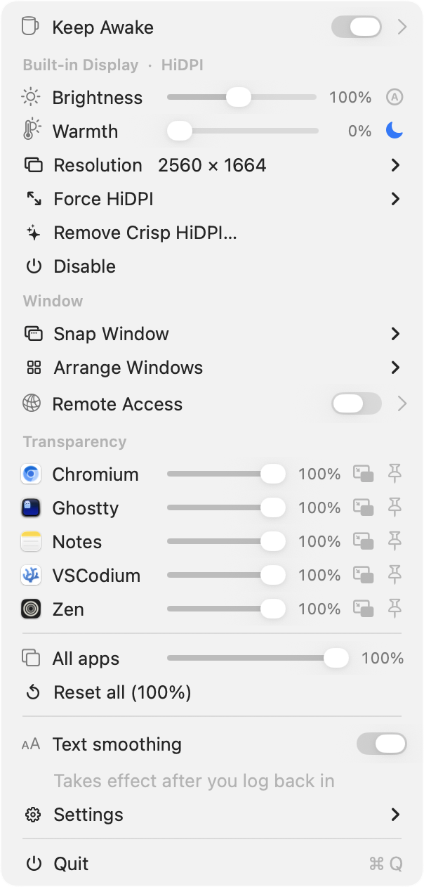
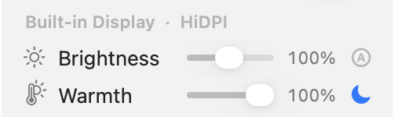
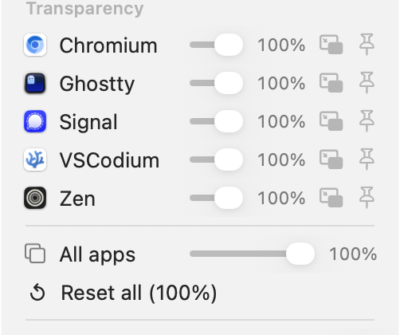
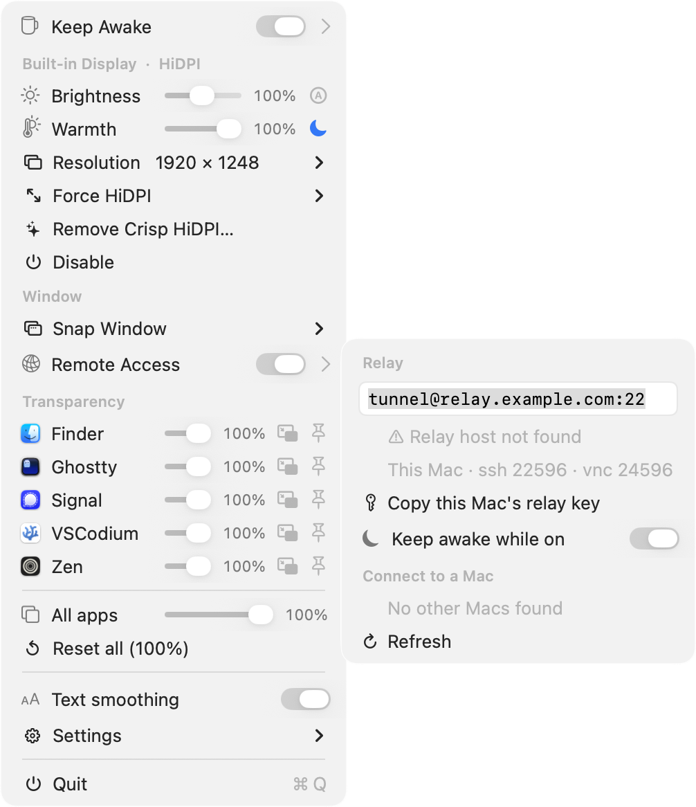
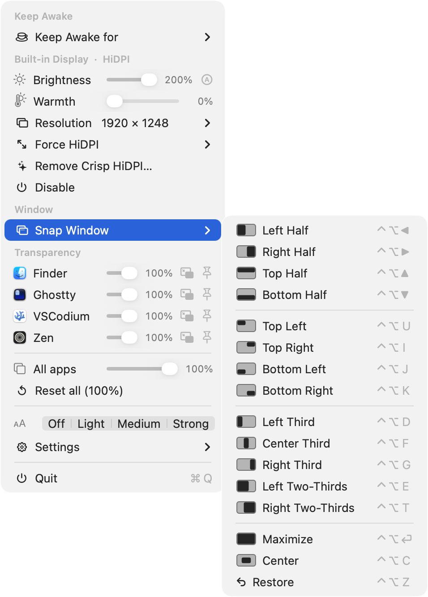
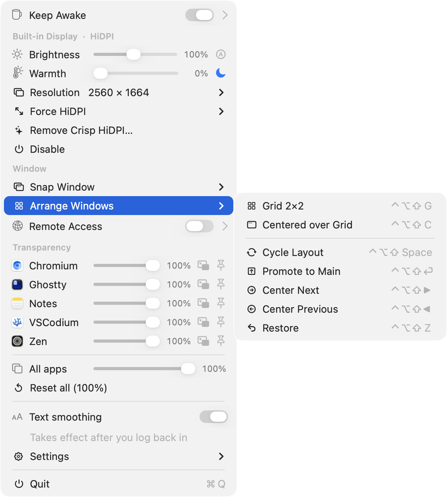
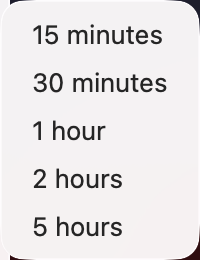
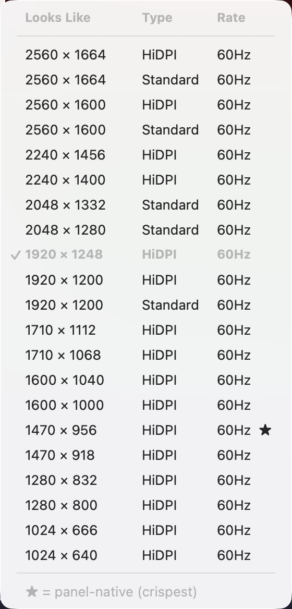
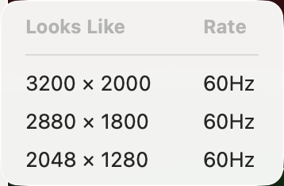
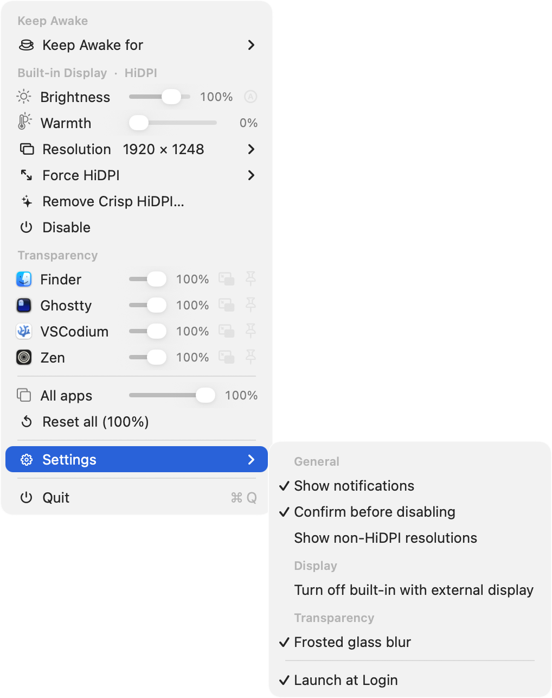

<div align="center">

<picture>
  <source media="(prefers-color-scheme: light)" srcset="assets/banner-light.png" />
  
</picture>

Disable & enable screens · Force HiDPI · brightness with EDR boost · color warmth (with auto-night) · window tiling/snapping · transparency, blur, keep-on-top & picture-in-picture · keep-awake · remote access.

[](https://github.com/oabdrabo/DisplayDeck/releases/latest)
[](LICENSE)
[](#-requirements)
[](#-requirements)
[](#-how-it-works)
[](https://displaydeck.pyxis3.ai/?utm_source=github&utm_medium=readme&utm_campaign=displaydeck)

<sub>

[**Features**](#-features) · [**Screenshots**](#-screenshots) · [**Install**](#-install) · [**Requirements**](#-requirements) · [**How it works**](#-how-it-works) · [**FAQ**](#-faq) · [**Support**](#-support--sponsors) · [**License**](#-license)

</sub>

</div>

---

> [!NOTE]
> **One mug in your menu bar instead of a stack of paid utilities** — free and open-source, under 1 MB, with no telemetry, no subscription, and no background daemon. Built entirely on Apple's own (private) frameworks; nothing is bundled or phoned home.

## ✨ Features

| | |
|---|---|
| 🖥️ **Disable / enable any display** | Turn off the built-in panel in clamshell/headless setups so it stays off when the lid opens. Optionally auto-disable the built-in whenever an external monitor connects — with a **failsafe** that re-enables the built-in if a disconnect (or a stale/phantom external entry) would otherwise leave you with no usable screen. |
| ⤢ **Force HiDPI** | Add crisp scaled (retina) resolutions to displays that don't natively offer them, via a mirrored private `SLVirtualDisplay`, plus a "More Space" supersampling tier. Optionally writes **persistent "crisp HiDPI" override plists**. |
| ☀️ **Brightness + boost** | Built-in panel via `DisplayServices`, externals via DDC/CI, an inline **auto-brightness** toggle, and an **EDR boost above 100%** clamped to the display's real, learned headroom (mild on a built-in, big on a true XDR/HDR panel) — colors preserved, auto-suspends in Mission Control. |
| 🌡️ **Warmth + auto-night** | Per-display color-temperature slider (f.lux / Night-Shift style) via gamma ramps — 6500 K neutral → ~3400 K warm, persisted, restores native ColorSync at 0%. An **automatic night schedule** (moon toggle) eases warmth on at dusk and off by morning, hands-free. |
| 🧩 **Window snapping** | Tile the focused window to **halves, quarters, thirds / two-thirds, maximize, center**, or **restore** — via **global `⌃⌥` keyboard shortcuts**, **dragging to a screen edge/corner** (with a live preview), or the **Window** menu. Uses the Accessibility API; works on a stock machine. |
| 🔳 **Window arrangement** | Tile **every** window on the screen at once: a **2×2 grid**, or one window **centered *over* the grid** (the others peek out around its edges). Toggle layouts, **promote** the focused window to the center, or **rotate** which window is centered — on global `⌃⌥⇧` shortcuts or the **Window → Arrange Windows** menu. Same Accessibility permission as snapping. |
| 🪟 **Window transparency** | Set per-app or all-window opacity for **any** app, via a self-contained scripting addition injected into Dock (no external tools). Optional **frosted-glass blur**, per-app **Keep on top**, and **Picture-in-Picture** (shrink a window into a still-usable floating corner). |
| ☕ **Keep awake** | An IOKit caffeine assertion so the Mac and its display don't sleep — indefinitely (toggle) or for a set duration (15 min → 5 h). Replaces KeepingYouAwake. |
| 🌐 **Remote access** | Reach this Mac — and your **other Macs** — from anywhere, with **nothing to install**. An auto-reconnecting **reverse-SSH** tunnel through a relay host *you* control forwards **SSH**, **Screen Sharing**, and **file transfer (SFTP)**; no Tailscale/Headscale or third-party agent. Doubles as a **client**: peers on the same relay are **auto-discovered with live online status**, so you can Screen Share, SSH, or transfer files to them from the menu. Optionally **keeps the Mac awake** while on so it stays reachable, and surfaces **why** a connection failed. |
| 🔤 **Text smoothing** | Toggle macOS's grayscale antialiasing **on/off** — a single **system-wide** switch that affects **every display, including the built-in** (`AppleFontSmoothing` isn't per-display). The effect is most visible on **non-Retina, external, or scaled** monitors; on a Retina panel it's subtle by design. (macOS treats the setting as binary — the old strength levels render identically.) Applies after a re-login. |

The menu-bar icon is an interactive **coffee mug**: left-click toggles keep-awake (filled cup = awake), right-click opens the menu.

## 📸 Screenshots

The menu-bar mug — an empty cup when idle, filled while keeping your Mac awake (left-click to toggle, right-click for the menu):

<p align="center"></p>

The menu — a **Keep Awake** row with an inline toggle, per-display **Brightness** (with the inline **Ⓐ** auto-brightness toggle) and **Warmth** sliders (with the **🌙** auto-night toggle), a **Window** snapping section, a **Remote Access** row, and per-app **Transparency** rows with frosted-glass, keep-on-top, and picture-in-picture toggles:

<p align="center"></p>

**Light, color & transparency** — per-display **Brightness** (with the EDR boost above 100%) and **Warmth** (with the 🌙 auto-night toggle), and per-app **opacity**, **keep-on-top** and **picture-in-picture**:

<p align="center">
  
  
</p>

**Remote access** — set the relay inline as a single `user@host:port`, copy this Mac's relay key, keep the Mac awake while on, and Screen Share / SSH / transfer files to your auto-discovered Macs (● live · ○ offline), all from the menu. If a connection fails it tells you why (here the placeholder `relay.example.com` doesn't resolve):

<p align="center"></p>

**Window snapping** — tile the focused window to halves, quarters, thirds, maximize or center, each with a layout glyph and a global `⌃⌥` shortcut:

<p align="center"></p>

**Window arrangement** — tile every window into a 2×2 grid, or float one centered over the grid (the rest peek out around it); cycle layouts, promote, or rotate the centered window with `⌃⌥⇧` shortcuts:

<p align="center"></p>

Submenus — Keep-Awake durations, the curated **Resolution** picker (★ = panel-native), the **Force HiDPI** "More Space" tier, and the grouped **Settings**:

<p align="center">
  
  
</p>
<p align="center">
  
  
</p>

## 📦 Install

**Homebrew** (cask):

```sh
brew install --cask oabdrabo/tap/displaydeck
```

<details>
<summary><b>From source</b></summary>

```sh
git clone https://github.com/oabdrabo/DisplayDeck.git
cd DisplayDeck
make install      # builds, signs, copies to /Applications, launches
```

Needs Xcode Command Line Tools (`xcode-select --install`). Other targets: `make` (build only), `make zip` (release artifact), `make clean`, `make uninstall`.

</details>

It launches at login by default — toggle that under the menu-bar icon → **Settings → Launch at Login**. The app is **self-signed** (not notarized), so Gatekeeper may warn on first open. The Homebrew cask strips the quarantine flag for you, so it just opens. If you installed it manually, either run `xattr -dr com.apple.quarantine /Applications/DisplayDeck.app`, or open **System Settings → Privacy & Security → Open Anyway** (on macOS 15+ the old right-click → Open no longer works).

## 🧹 Uninstall

```sh
brew uninstall --cask displaydeck      # if installed via Homebrew
```

From source, or to remove the Dock scripting addition installed for transparency:

```sh
make uninstall      # removes the app + (with admin) the scripting addition & sudoers entry
```

## ⚙️ Requirements

- **macOS 14+ on Apple Silicon.**
- **Window transparency / blur / keep-on-top** need **SIP disabled** and the `-arm64e_preview_abi` boot-arg — these allow injecting the payload into Dock. First use prompts once for an admin password to install the scripting addition; afterwards it loads silently. *(Display / HiDPI / brightness / warmth work without them.)*
- **Window snapping** and **Picture-in-Picture** ask for Accessibility permission once (no SIP changes needed).
- **Remote access** needs a **relay host you can SSH into** (e.g. a cheap VPS or your homelab box) with a forwarding-only `tunnel` user; nothing is installed on it beyond an `authorized_keys` line. It uses macOS's built-in `/usr/bin/ssh` plus the system **Remote Login** and **Screen Sharing** toggles (enabled for you on first use).

## 🔧 How it works

- Disabling uses the private `CGSConfigureDisplayEnabled`; Force HiDPI mirrors the panel onto a private `SLVirtualDisplay` pinned to the desired logical size, and "crisp HiDPI" writes display-override plists under `/Library/Displays/.../Overrides`.
- Transparency injects a payload into Dock (`task_for_pid` + an arm64e bootstrap) that calls `SLSSetWindowAlpha` / `SLSSetWindowBackgroundBlurRadius` / `SLSSetWindowLevel` over a private unix socket. The injection technique is adapted from [yabai](https://github.com/koekeishiya/yabai) (MIT); see `sa/loader.m`.
- Warmth loads per-channel gamma ramps with the public `CGSetDisplayTransferByTable`; the brightness boost is a borderless EDR overlay (`CAMetalLayer`, multiply blend) clamped each frame to the live `maximumExtendedDynamicRangeColorComponentValue`.
- Picture-in-Picture resizes/moves the real window through the Accessibility API (`AXUIElement`) and reuses Keep-on-top for the float.
- Window snapping moves/resizes the focused window through the same `AXUIElement` API; global shortcuts are registered as Carbon `RegisterEventHotKey` hot keys, and drag-to-snap watches a global mouse monitor to detect edge/corner drops.
- Remote access spawns `/usr/bin/ssh -N -R …` to publish this Mac's SSH/Screen-Sharing ports on relay loopback ports (derived from the hostname), auto-reconnecting via `NSTask`. Peer discovery is a read-only forced command on the relay that lists every authorized Mac's name and ports; connecting opens a `-L` forward to `vnc://localhost` or a `ProxyJump` SSH session.

Because these are private APIs, behaviour can change between macOS releases.

## 🗂️ Project layout

```
src/
  main.m              app entry point
  app/                AppDelegate — status item, menu, UI
  display/            DisplayManager, HiDPIInjector, Brightness,
                      BrightnessBooster (EDR boost), ColorTemperature (warmth)
  transparency/       WindowTransparency — in-app client for the Dock payload
  window/             WindowPiP — picture-in-picture; WindowManager — tiling/snapping
  power/              Caffeine — keep-awake power assertion
  remote/             RemoteAccess — reverse-SSH tunnel, relay config, peer discovery
  common/             DDUtil — shared error/AppleScript helpers
sa/                   scripting addition injected into Dock (loader.m, payload.m)
tools/                build_icon.m — generates AppIcon.icns
resources/            Info.plist
```

## ❓ FAQ

**Will this harm my Mac?**
No. It uses Apple's own frameworks (no kernel extensions), and everything it does is reversible — displays re-enable, warmth and brightness reset, windows restore, and quitting the app undoes the live overlays.

**Is the brightness boost real, or just a dimming trick?**
Real. It's an EDR (extended dynamic range) overlay that drives the panel past its normal 100%, clamped each frame to the display's *actual* headroom — modest on a standard panel, large on an XDR/HDR one. Colors are preserved, and it auto-suspends during Mission Control.

**Why does window transparency need SIP disabled?**
Making another app's window transparent means injecting a small payload into Dock, which macOS only permits with SIP off plus the `-arm64e_preview_abi` boot-arg. Everything else — display control, HiDPI, brightness, warmth, keep-awake — works on a stock machine.

**Does it run on Intel Macs?**
No — Apple Silicon only. The boost relies on EDR and the Dock-injection path is arm64e.

**Will updating reset my settings?**
No. Brightness, warmth, and per-app preferences live in your user defaults and persist across updates.

## 🤝 Contributing

Issues, ideas, and PRs are welcome — see **[CONTRIBUTING.md](CONTRIBUTING.md)** for build, test, and PR guidelines. Since everything rides on private macOS APIs, real-device verification is especially valued.

## 💖 Support & sponsors

DisplayDeck is free, open-source, and has no tracking or ads. If it's useful to you, you can support continued development — pay what you like, once or monthly:

<p align="center">
  <a href="https://donate.stripe.com/3cI6oI7Gh1PG0eV8MJ5kk00"></a>
  &nbsp;
  <a href="https://buy.stripe.com/00wbJ2f8J51S9Pv1kh5kk01"></a>
</p>

## 📄 License

[MIT](LICENSE) © 2026 Omar Abdrabo
